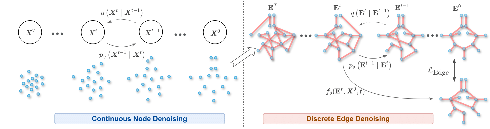
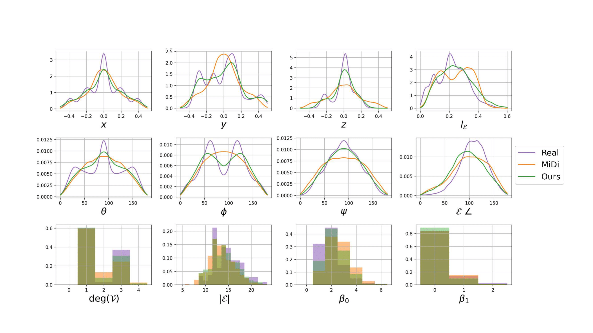

# 3D Vessel Graph Generation Using Denoising Diffusion

Chinmay Prabhakar*, Suprosanna Shit*, Fabio Musio, Kaiyuan Yang, Tamaz Amiranashvili, Johannes Paetzold, Hongwei Li, Bjoern Menze 

MICCAI 2024



The repository contains the official code implementation of the MICCAI 2024 paper, _3D Vessel Graph Generation Using Denoising Diffusion_.

**TL;DR:** We propose a data-driven generative model for vascular graphs. Our two-step denoising diffusion approach is capable of generating complex topological structures, including cycles.


#### 
The code base derives heavily from **MiDi: Mixed Graph and 3D Denoising Diffusion for Molecule Generation**. We thank the authors for releasing their code and answering our queries.  

## Steps

#### Create a new virtual environment
We recommend creating a new virtual environment to run the code. We used the Python `venv` functionality to create a python3 virtual environment.
Then execute `pip install -r requirements.txt` to install the required dependencies.

#### Download the dataset
Please use the [link](https://syncandshare.lrz.de/getlink/fi16HTxauMHGWpbBbRSeSD/) to download the graph datasets 

#### Prepare Dataset
1. The segmentations for vessap are not perfect. They often contain entries with a negative radius. Thus, run the script `raw_data_to_midi_format_converter` in the `bootstrap` package. It will filter away the negative edges and convert the data into a format the framework can efficiently process. The following changes need to be made
   1. Change the location of `unprocessed_vessap_graph_path` to the location where the vessap graph is stored.
   2. Change the location of `non_neg_rad_graph_loc` to where the non-negative radius graphs should be stored.
2. For the CoW datasets, the above steps are not needed. Please directly download the data from the link. However, please update the `self.cow_file_path` in the `corwn_dataset.py` file to reflect the download location. It should be `YOUR_LOCAL_PATH/voreen_output` 


#### Run the first diffusion model (i.e., for the node coordinates)
After finishing the previous step, run the first diffusion model by executing  the`diff_nodes.py` file from the `bootstrap` package.

For simplicity, the module does not use Omegaconf. However, please make sure it has the same dimension as used by the `discrete_cow.yaml` or `discrete_vessap.yaml` files from the `configs/model` directory.

Please execute the module with both datasets to train the individual coordinate diffusion model. 

#### Run the second diffusion model (i.e., for the edge connectivity)
Update the `main.py` file to select the dataset. The two datasets have their respective configurations stored in files `config_cow.yaml` and `config_vessap.yaml`. Change the parameter of `config_name` in `@hydra.main` invocation.

#### Sampling
For computational efficiency, we do not sample the graphs during the training process. We use the last checkpoint to generate new graphs. However, the best **5** models based on the validation loss are also saved. Please use this script to sample new graphs.

```
python -m midi.main general.test_only="<Checkpoint Folder>/last-v1.ckpt general.final_model_chains_to_save=0  general.final_model_samples_to_generate=5000 general.final_model_samples_to_save=5000
```
Please update the path to the checkpoint folder. This folder path is governed by the configuration files `hydra.run.dir` attribute. 

This operation generates a folder named `test_generated_samples_X` in the output folder specified by the config files. The X in {0, 1, 2, 3, ...} represents the number of times a particular checkpoint is used for generating samples. The unique nomenclature enables us to use the same checkpoint and generate a different number of samples.
Each run will save the results in a separate folder.

#### Generating vtp files and statistics
Finally, execute the script `convert_graph_to_vtp.py` in the `post_process` module. Please update the attribute `load_dir` to point to the `test_generated_samples_X` folder from the last step.

The script will save the generated graphs in a new folder, `synthetic_data/vtp`, under the `test_generated_samples_X`. Thus, each run will save all the generated samples in a separate folder.

One can use Paraview to view the generated results.

The statistics and their plots can be obtained by executing the script `post_process/stats_comparison.py`. Please make sure to change the attributes
`REAL_VESSAP` and `REAL_CoW` to point to the correct folder location. 

The plots in the paper are created using the file `comparitive_plots.py`


## Cite this paper